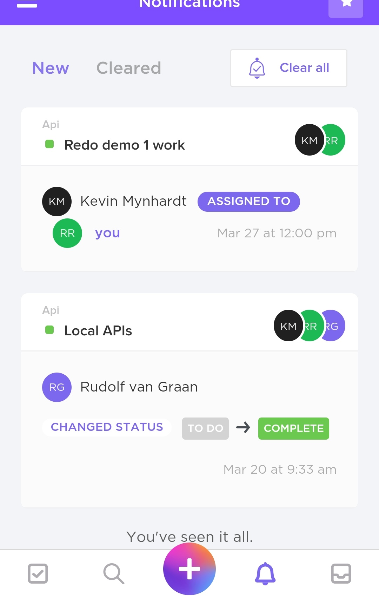
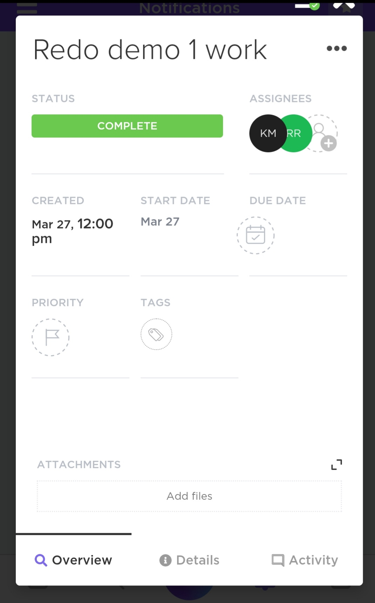
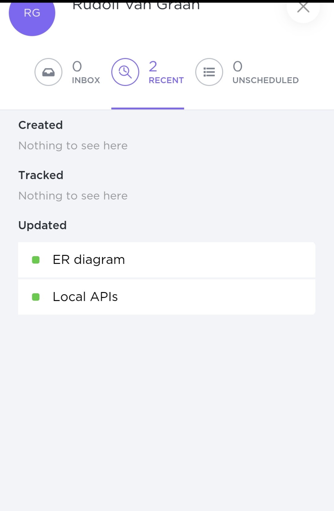

# Theta Notification

### Personal site

* [u16040865](https://u16040865.github.io)
  
* [u16207948](https://rammbudavictor.wixsite.com/website)

* [u17151849](https://cheesecakecoding.github.io/)

# Manangement tool 

## Tool used: clickup 2.0

* KEY:
  * KM (Kevin Mynhardt) u17151849 
       * API 
       * Local api for Demo 1
  * RR(you) (Rammbuda Rilwele) u16207948 
       * Redue Demo 1 work And the landing page
       * Local api for Demo 1
  * RG (Rudolf van Graan) u16040865
      * ER diadrams 
      * Local api for Demo 1

###  *Everyone had the responsubility to check everyone task and aprove & make/suggest things to be added 

